> **How the magic works under the hood**
> 

---

## **🏗️ System Overview**

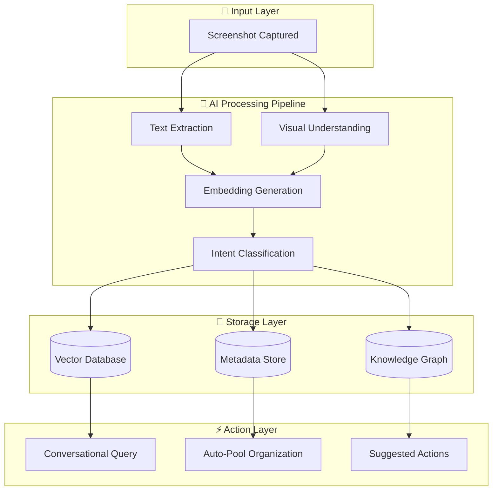

---

## **🔧 Core Tech Stack**

| Layer | Technology | Purpose |
| --- | --- | --- |
| **Vision AI** | GPT-4V / Claude Vision / Gemini Pro Vision | Understand image content |
| **OCR** | Apple Vision Framework / Google Cloud Vision / Tesseract | Extract text from images |
| **Embeddings** | OpenAI `text-embedding-3-large` / Cohere Embed | Convert meaning to vectors |
| **Vector DB** | Pinecone / Weaviate / Qdrant / ChromaDB | Semantic search |
| **Metadata DB** | PostgreSQL / Supabase | Structured data storage |
| **Knowledge Graph** | Neo4j / TigerGraph | Entity relationships |
| **LLM** | GPT-4 / Claude 3 / Gemini | Conversational interface |
| **Actions** | iOS Shortcuts / Android Intents / Zapier | Trigger real-world actions |
| **Mobile** | Swift (iOS) / Kotlin (Android) / React Native | Client apps |
| **Backend** | FastAPI / Node.js | API services |

---

## **📋 Scenario 1: Conversational Memory**

> *"What did I do on my world trip last December?"*
> 

### **The Flow**

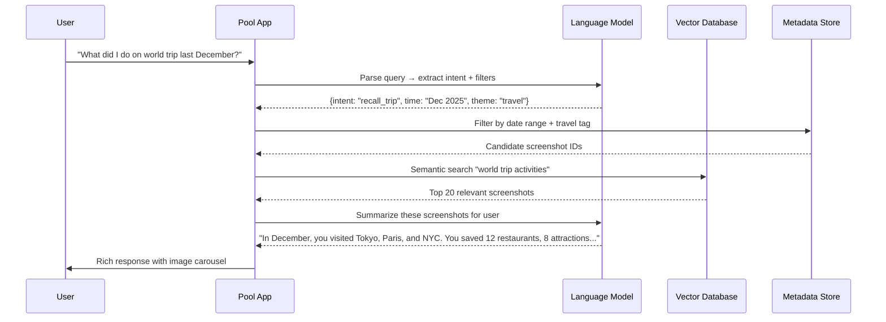

### **How It Extracts Information**

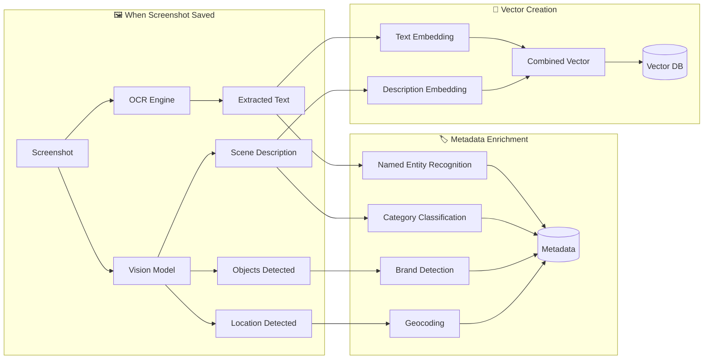

### **Tech Behind Each Step**

| Step | Technology | What Happens |
| --- | --- | --- |
| **OCR** | Apple Vision / Google Vision API | Extracts all visible text from screenshot |
| **Vision Model** | GPT-4V / Gemini Pro Vision | Describes scene, detects objects, identifies context |
| **NER** | spaCy / Hugging Face NER | Extracts entities (dates, places, products, people) |
| **Geocoding** | Google Maps API | Converts detected addresses to coordinates |
| **Embedding** | OpenAI Embeddings | Converts text + description to 1536-dim vector |
| **Vector DB** | Pinecone | Stores vector for semantic search |
| **LLM Query** | GPT-4 | Understands natural questions, generates responses |

---

## **📋 Scenario 2: Auto-Tagging & Theme Clustering**

> *"Show me all startup ideas from last 3 months"*
> 

### **The Flow**

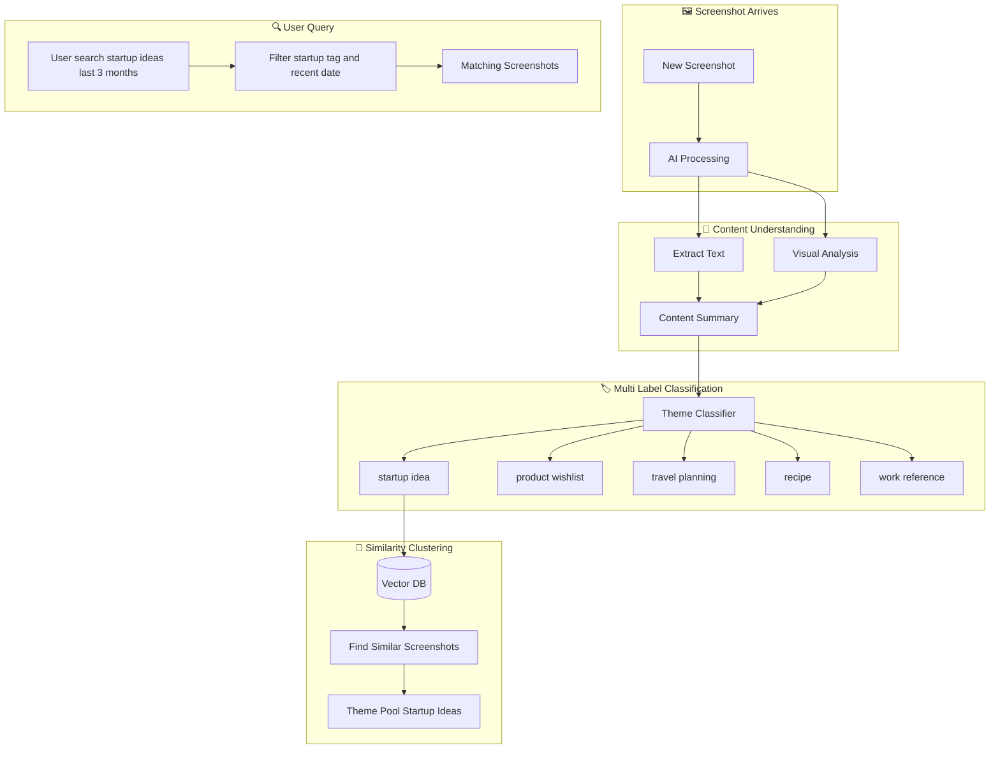

### **How Theme Classification Works**

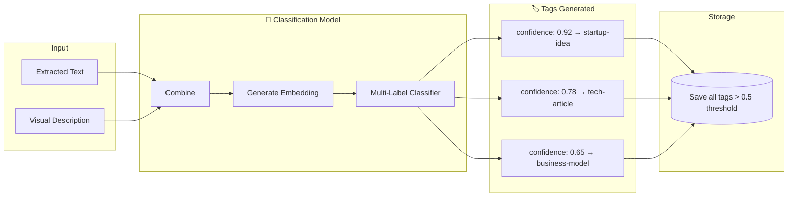

### **Tech Stack for Clustering**

| Component | Technology | Purpose |
| --- | --- | --- |
| **Multi-Label Classifier** | Fine-tuned BERT / SetFit | Assigns multiple relevant tags |
| **Theme Taxonomy** | Custom ontology (~100 themes) | Predefined categories |
| **Zero-Shot Classification** | CLIP / BLIP-2 | Classify without training data |
| **Clustering** | K-Means on embeddings | Group similar screenshots |
| **Dynamic Themes** | LLM-generated labels | Create new themes automatically |

### **Example: "Startup Ideas" Detection**

```
Screenshot contains:
├── Text: "Revenue model: SaaS + marketplace fee"
├── Visual: Whiteboard with diagrams
├── Context: Notes app screenshot
│
AI Analysis:
├── OCR Text: "Revenue model: SaaS + marketplace fee, Target: SMBs, MVP: 3 months"
├── Vision: "Handwritten notes on whiteboard, business diagram, arrows connecting boxes"
├── Entities: ["SaaS", "marketplace", "MVP", "SMBs"]
│
Classification:
├── startup-idea: 0.94 ✓
├── business-planning: 0.87 ✓
├── notes: 0.72 ✓
├── recipe: 0.02 ✗
└── travel: 0.01 ✗

```

---

## **📋 Scenario 3: Intent-Based Organization**

> *Screenshots automatically organized by "why you saved it"*
> 

### **The Flow**

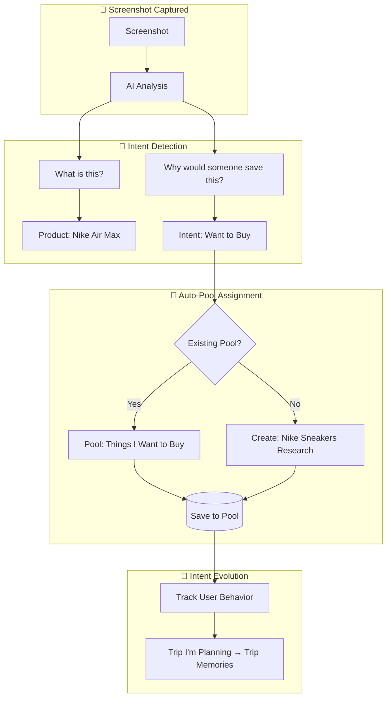

### **How Intent is Inferred**

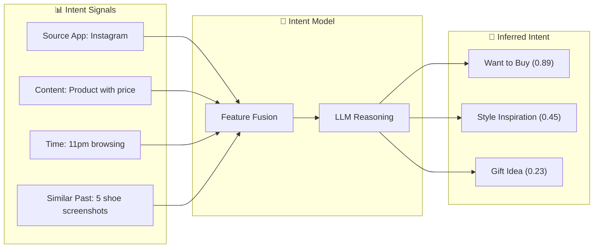

### **Intent Classification Examples**

| Screenshot | Signals Detected | Inferred Intent |
| --- | --- | --- |
| Nike shoes on Instagram | Product + Price + Fashion | "Things I want to buy" |
| Airbnb listing | Property + Location + Dates | "Trip I'm planning" |
| Twitter thread about AI | Tech content + Long text | "Learning / Research" |
| Restaurant menu | Food + Location + Hours | "Places to eat" |
| Code snippet | Programming + Error message | "Work reference" |
| Baby products | Products + Age-specific | "Baby registry" |

### **Tech for Intent Detection**

| Component | Technology | Purpose |
| --- | --- | --- |
| **Source Detection** | Screenshot metadata / URL extraction | Know where it came from |
| **Content Classification** | Vision LLM | Understand what's in image |
| **Intent Reasoning** | GPT-4 / Claude with prompting | Infer "why saved" |
| **Personalization** | User behavior model | Learn individual patterns |
| **Pool Matching** | Semantic similarity | Match to existing pools |

---

## **📋 Scenario 4: Screenshot → Intent → Action**

> *Screenshot a concert ticket → "Add to calendar?"*
> 

### **The Flow**

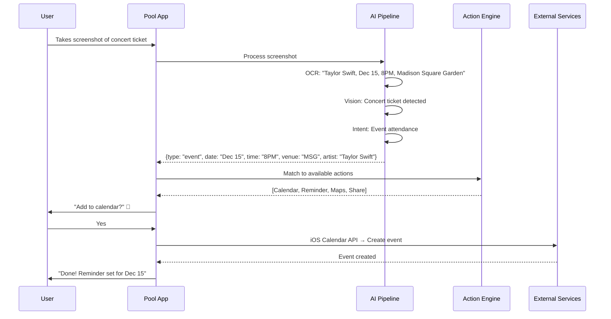

### **Action Detection Pipeline**

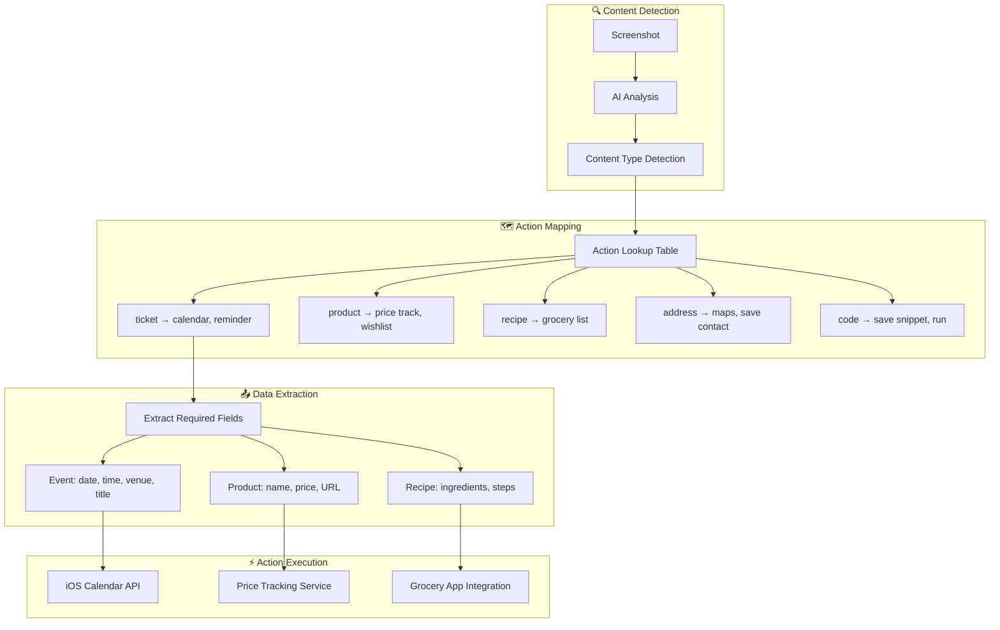

### **Action Library**

| Content Type | Detected Via | Extracted Data | Available Actions |
| --- | --- | --- | --- |
| **Concert Ticket** | "ticket", QR code, date/time | Event, Date, Venue | 📅 Calendar, ⏰ Reminder, 🗺️ Maps |
| **Flight Booking** | Airline logo, flight #, times | Flight, Gate, Terminal | 📅 Calendar, ✈️ Track flight, 🗺️ Airport |
| **Product** | Price tag, product name, brand | Name, Price, Store | 💰 Track price, 🛒 Add to cart, 📋 Wishlist |
| **Recipe** | Ingredients list, cooking steps | Ingredients, Instructions | 🥕 Grocery list, 📖 Save recipe, ⏱️ Timer |
| **Restaurant** | Menu, hours, address | Name, Location, Cuisine | 📍 Maps, 📞 Call, 📅 Reserve |
| **Contact Info** | Phone, email, name | Contact details | 👤 Save contact, 📧 Email, 📞 Call |
| **Address** | Street, city, zip | Full address | 🗺️ Maps, 🚗 Navigate, 📍 Save location |
| **Meeting/Event** | Date, time, attendees | Event details | 📅 Calendar, 👥 Invite, 🔔 Remind |
| **Password/Code** | Alphanumeric strings | Sensitive data | 🔐 Secure vault, 📋 Copy |
| **QR Code** | QR pattern detected | Encoded data | 🔗 Open link, 📋 Copy, 💾 Save |

### **Integration Architecture**

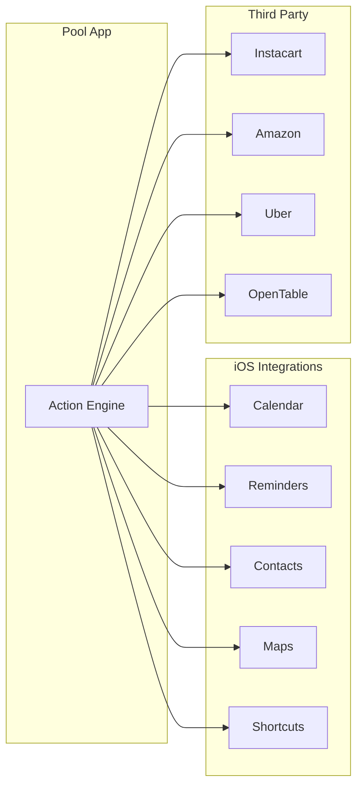

---

## **🔄 Complete Data Flow**

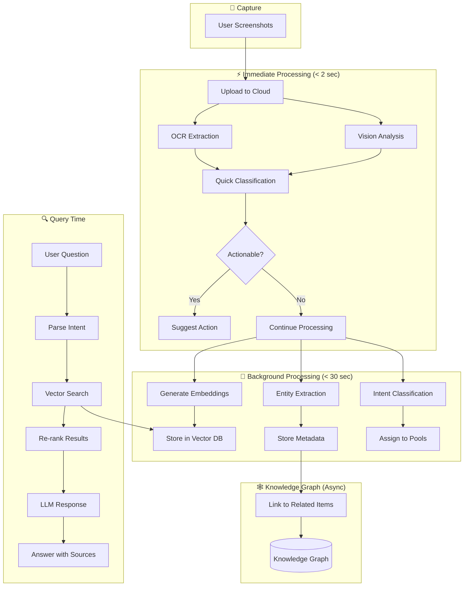

---

## **🛠️ Full Tech Stack Summary**

```
┌─────────────────────────────────────────────────────────────┐
│                    POOL.DAY ARCHITECTURE                      │
├─────────────────────────────────────────────────────────────┤
│  📱 CLIENT LAYER                                             │
│  ├── iOS App (Swift + SwiftUI)                              │
│  ├── Android App (Kotlin + Jetpack Compose)                 │
│  └── Web App (Next.js + React)                              │
├─────────────────────────────────────────────────────────────┤
│  🔌 API LAYER                                                │
│  ├── REST API (FastAPI / Node.js)                           │
│  ├── GraphQL (Apollo Server)                                │
│  └── WebSocket (Real-time sync)                             │
├─────────────────────────────────────────────────────────────┤
│  🧠 AI LAYER                                                 │
│  ├── Vision: GPT-4V / Claude Vision / Gemini Pro Vision     │
│  ├── OCR: Apple Vision / Google Cloud Vision                │
│  ├── Embeddings: OpenAI text-embedding-3-large              │
│  ├── LLM: GPT-4 / Claude 3 Opus                             │
│  ├── Classification: Fine-tuned BERT / Zero-shot CLIP       │
│  └── NER: spaCy / Hugging Face Transformers                 │
├─────────────────────────────────────────────────────────────┤
│  💾 DATA LAYER                                               │
│  ├── Vector DB: Pinecone / Weaviate / Qdrant                │
│  ├── Metadata: PostgreSQL + Supabase                        │
│  ├── Knowledge Graph: Neo4j                                 │
│  ├── Cache: Redis                                           │
│  ├── Object Storage: S3 / Cloudflare R2                     │
│  └── Search: Elasticsearch (hybrid search)                  │
├─────────────────────────────────────────────────────────────┤
│  ⚡ ACTION LAYER                                             │
│  ├── iOS: Calendar, Reminders, Contacts, Maps APIs          │
│  ├── Android: Intents, WorkManager                          │
│  ├── Integrations: Zapier, Make, n8n                        │
│  └── Third-party: Instacart, OpenTable, Uber APIs           │
├─────────────────────────────────────────────────────────────┤
│  🔐 INFRASTRUCTURE                                           │
│  ├── Cloud: AWS / GCP / Vercel                              │
│  ├── Auth: Clerk / Auth0                                    │
│  ├── Encryption: End-to-end for sensitive pools             │
│  └── CDN: Cloudflare                                        │
└─────────────────────────────────────────────────────────────┘

```

---

## **⏱️ Processing Timeline**

```
SCREENSHOT TAKEN
     │
     ▼ (0ms)
┌─────────────────┐
│ Upload to Cloud │
└────────┬────────┘
         │
     ▼ (500ms)
┌─────────────────┐
│ OCR + Vision    │ ◄── Parallel processing
└────────┬────────┘
         │
     ▼ (1.5s)
┌─────────────────┐
│ Quick Actions   │ ◄── "Add to calendar?" shown
│ Suggested       │
└────────┬────────┘
         │
     ▼ (5s) Background
┌─────────────────┐
│ Full Embedding  │
│ + Classification│
└────────┬────────┘
         │
     ▼ (15s) Background
┌─────────────────┐
│ Knowledge Graph │
│ Linking         │
└────────┬────────┘
         │
     ▼ (Ready)
┌─────────────────┐
│ Fully Queryable │
│ + Organized     │
└─────────────────┘

```

---

## **🎯 Key Technical Insights**

### **Why This Works**

1. **Embeddings are the magic** — Converting screenshots to vectors enables semantic search
2. **Multimodal AI is mature** — GPT-4V/Gemini/Claude can truly "see" and understand
3. **Intent > Content** — Understanding "why" not just "what" is the differentiator
4. **Actions close the loop** — Screenshots become starting points for tasks

### **Challenges & Solutions**

| Challenge | Solution |
| --- | --- |
| Privacy (personal screenshots) | On-device processing + E2E encryption |
| Speed (real-time suggestions) | Edge AI + async background processing |
| Accuracy (wrong classifications) | Human feedback loop + confidence thresholds |
| Scale (millions of screenshots) | Efficient vector indexing + caching |
| Cost (AI API calls) | Batch processing + smaller models for triage |

---

## **📊 Database Schemas**

### **Screenshot Metadata Table (PostgreSQL)**

```sql
CREATE TABLE screenshots (
    id              UUID PRIMARY KEY DEFAULT gen_random_uuid(),
    user_id         UUID NOT NULL REFERENCES users(id),
    created_at      TIMESTAMP WITH TIME ZONE DEFAULT NOW(),

    -- Source Information
    source_app      TEXT,           -- "Instagram", "Safari", "Notes"
    source_url      TEXT,           -- Extracted URL if present
    device          TEXT,           -- "iPhone 15 Pro"

    -- AI-Extracted Content
    ocr_text        TEXT,           -- Full extracted text
    vision_desc     TEXT,           -- AI scene description
    detected_lang   TEXT,           -- "en", "es", "ja"

    -- Classification
    content_type    TEXT,           -- "product", "recipe", "ticket", "article"
    primary_intent  TEXT,           -- "want_to_buy", "trip_planning", "learning"
    confidence      FLOAT,          -- 0.0 - 1.0

    -- Entities (JSONB for flexibility)
    entities        JSONB,          -- {"brands": ["Nike"], "places": ["NYC"], "prices": ["$149"]}

    -- Location
    geo_lat         FLOAT,
    geo_lng         FLOAT,
    location_name   TEXT,

    -- Storage
    image_url       TEXT NOT NULL,  -- S3/R2 URL
    thumbnail_url   TEXT,

    -- Status
    processing_status TEXT DEFAULT 'pending', -- "pending", "processing", "complete", "failed"
    is_deleted      BOOLEAN DEFAULT FALSE,

    -- Search optimization
    search_vector   tsvector        -- For PostgreSQL full-text search
);

-- Indexes for fast queries
CREATE INDEX idx_screenshots_user ON screenshots(user_id);
CREATE INDEX idx_screenshots_created ON screenshots(created_at DESC);
CREATE INDEX idx_screenshots_intent ON screenshots(primary_intent);
CREATE INDEX idx_screenshots_search ON screenshots USING GIN(search_vector);
CREATE INDEX idx_screenshots_entities ON screenshots USING GIN(entities);

```

### **Tags & Pools Tables**

```sql
-- Multi-label tags per screenshot
CREATE TABLE screenshot_tags (
    screenshot_id   UUID REFERENCES screenshots(id),
    tag             TEXT NOT NULL,
    confidence      FLOAT,
    source          TEXT,           -- "ai_auto", "user_manual", "inferred"
    PRIMARY KEY (screenshot_id, tag)
);

-- User-created and auto-generated pools
CREATE TABLE pools (
    id              UUID PRIMARY KEY DEFAULT gen_random_uuid(),
    user_id         UUID NOT NULL REFERENCES users(id),
    name            TEXT NOT NULL,              -- "Trip to Japan"
    description     TEXT,
    pool_type       TEXT DEFAULT 'intent',      -- "intent", "manual", "shared"
    intent_pattern  TEXT,                       -- Auto-pool matching pattern
    is_smart        BOOLEAN DEFAULT TRUE,       -- AI auto-adds matching screenshots
    created_at      TIMESTAMP WITH TIME ZONE DEFAULT NOW(),
    cover_image_id  UUID REFERENCES screenshots(id)
);

-- Many-to-many: screenshots can belong to multiple pools
CREATE TABLE pool_screenshots (
    pool_id         UUID REFERENCES pools(id),
    screenshot_id   UUID REFERENCES screenshots(id),
    added_at        TIMESTAMP WITH TIME ZONE DEFAULT NOW(),
    added_by        TEXT DEFAULT 'ai',          -- "ai", "user"
    PRIMARY KEY (pool_id, screenshot_id)
);

```

### **Vector Storage Schema (Pinecone/Qdrant)**

```json
{
  "id": "ss_abc123",
  "values": [0.0234, -0.0891, 0.1234, ...],  // 1536-dim or 3072-dim vector
  "metadata": {
    "user_id": "user_xyz",
    "created_at": "2025-12-15T10:30:00Z",
    "content_type": "product",
    "primary_intent": "want_to_buy",
    "tags": ["fashion", "sneakers", "nike"],
    "source_app": "Instagram",
    "has_price": true,
    "detected_brands": ["Nike", "Air Max"],
    "text_snippet": "Nike Air Max 90 - $149.99"
  }
}

```

### **Knowledge Graph Schema (Neo4j)**

```
// Node types
(:Screenshot {id, user_id, created_at, content_type})
(:Entity {name, type})  // type: "brand", "place", "person", "product"
(:Pool {id, name, user_id})
(:Intent {name})        // "want_to_buy", "trip_planning", etc.

// Relationships
(s:Screenshot)-[:CONTAINS]->(e:Entity)
(s:Screenshot)-[:BELONGS_TO]->(p:Pool)
(s:Screenshot)-[:HAS_INTENT]->(i:Intent)
(s1:Screenshot)-[:SIMILAR_TO {score: 0.85}]->(s2:Screenshot)
(e1:Entity)-[:RELATED_TO]->(e2:Entity)

// Example query: Find all screenshots related to "Nike" products saved for buying
MATCH (s:Screenshot)-[:CONTAINS]->(e:Entity {name: "Nike", type: "brand"})
MATCH (s)-[:HAS_INTENT]->(i:Intent {name: "want_to_buy"})
RETURN s ORDER BY s.created_at DESC LIMIT 20

```

---

## **🧮 Multimodal Embeddings Deep Dive**

### **How Image + Text = Single Vector**

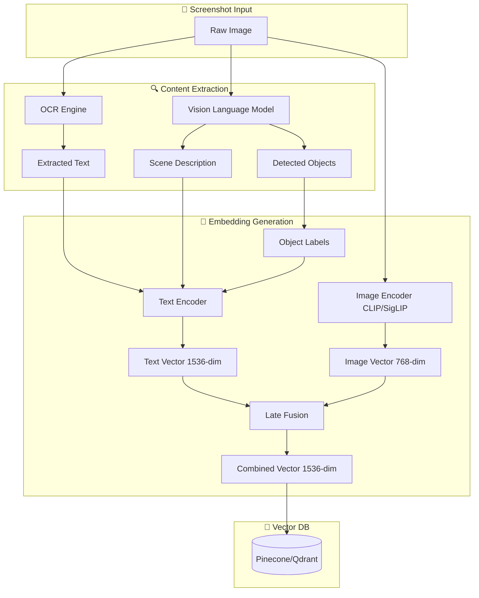

### **Embedding Model Options**

| Model | Dimensions | Strengths | Use Case |
| --- | --- | --- | --- |
| **OpenAI text-embedding-3-large** | 3072 | Best text understanding | Primary text embedding |
| **OpenAI text-embedding-3-small** | 1536 | Cost-effective, fast | Quick triage |
| **Cohere embed-v3** | 1024 | Multilingual | International users |
| **CLIP ViT-L/14** | 768 | Image-text alignment | Visual similarity |
| **SigLIP** | 1152 | Better than CLIP | Visual search |
| **Nomic Embed Vision** | 768 | Open source | Cost-sensitive |

### **Fusion Strategy**

```python
# Late fusion: combine text and image embeddings
def create_multimodal_embedding(screenshot):
    # Extract text
    ocr_text = extract_text(screenshot.image)
    vision_desc = describe_image(screenshot.image)
    combined_text = f"{ocr_text}\n\n{vision_desc}"

    # Generate embeddings
    text_embedding = openai.embed(combined_text)      # 1536-dim
    image_embedding = clip.encode_image(screenshot)   # 768-dim

    # Project image embedding to same dimension
    image_projected = projection_layer(image_embedding)  # 768 -> 1536

    # Weighted combination (text usually more important for screenshots)
    alpha = 0.7  # Text weight
    final_embedding = alpha * text_embedding + (1 - alpha) * image_projected

    # Normalize
    return normalize(final_embedding)

```

---

## **🔍 RAG Pipeline for Conversational Queries**

> *How "What did I do in Tokyo?" actually works*
> 

### **Full RAG Architecture**

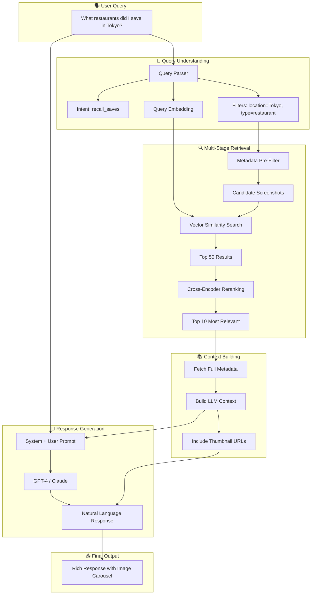

### **Retrieval Code Example**

```python
async def answer_query(user_id: str, query: str):
    # Step 1: Parse query with LLM
    parsed = await llm.parse_query(query)
    # {"intent": "recall_saves", "filters": {"location": "Tokyo", "type": "restaurant"},
    #  "time_range": null, "search_terms": "restaurants Tokyo"}

    # Step 2: Pre-filter by metadata
    candidates = await db.filter_screenshots(
        user_id=user_id,
        location_contains="Tokyo",
        content_type="restaurant",
        limit=500
    )
    candidate_ids = [s.id for s in candidates]

    # Step 3: Vector search within candidates
    query_embedding = await embed(parsed["search_terms"])
    vector_results = await vector_db.search(
        vector=query_embedding,
        filter={"id": {"$in": candidate_ids}},
        top_k=50
    )

    # Step 4: Rerank with cross-encoder
    reranked = await reranker.rerank(
        query=query,
        documents=[r.metadata["text_snippet"] for r in vector_results],
        top_k=10
    )

    # Step 5: Build context for LLM
    context_screenshots = [vector_results[i] for i in reranked.indices]
    context = build_context(context_screenshots)

    # Step 6: Generate response
    response = await llm.generate(
        system="You are Pool, an AI assistant that helps users recall their saved screenshots.",
        user=f"User asked: {query}\n\nRelevant screenshots:\n{context}",
        max_tokens=500
    )

    return {
        "answer": response,
        "sources": [s.id for s in context_screenshots],
        "thumbnails": [s.thumbnail_url for s in context_screenshots]
    }

```

### **Reranking for Accuracy**

| Stage | Model | Purpose | Latency |
| --- | --- | --- | --- |
| **Vector Search** | Bi-encoder (embeddings) | Fast recall, finds candidates | ~50ms |
| **Reranking** | Cross-encoder (Cohere Rerank / BGE) | Precise relevance scoring | ~200ms |
| **LLM Filtering** | GPT-4 | Final verification if needed | ~500ms |

---

## **🔐 Privacy & Security Architecture**

### **On-Device vs Cloud Processing**

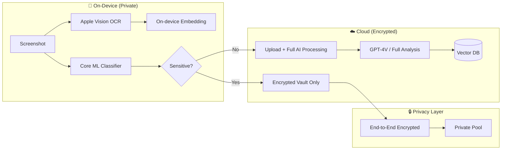

### **Sensitivity Detection**

```python
SENSITIVE_PATTERNS = [
    r'\b\d{3}-\d{2}-\d{4}\b',      # SSN
    r'\b\d{16}\b',                  # Credit card
    r'password|pwd|secret',         # Passwords
    r'\b[A-Z]{2}\d{6,9}\b',         # Passport/ID numbers
    r'medical|diagnosis|prescription',
    r'bank|account.*number',
]

def is_sensitive(ocr_text: str, vision_desc: str) -> bool:
    combined = f"{ocr_text} {vision_desc}".lower()
    for pattern in SENSITIVE_PATTERNS:
        if re.search(pattern, combined, re.IGNORECASE):
            return True

    # Also check vision classification
    if "document" in vision_desc and any(
        word in vision_desc for word in ["id", "license", "passport", "medical"]
    ):
        return True

    return False

```

### **Encryption Strategy**

| Data Type | Storage | Encryption | Access |
| --- | --- | --- | --- |
| **Regular screenshots** | Cloud (S3/R2) | AES-256 at rest | API with auth |
| **Sensitive pool** | Cloud with E2E | E2E (only user has key) | Biometric unlock |
| **Embeddings** | Vector DB | Platform encryption | Filtered by user_id |
| **OCR text** | PostgreSQL | Column-level encryption | Query with auth |
| **Metadata** | PostgreSQL | At rest | Standard auth |

### **Zero-Knowledge Option**

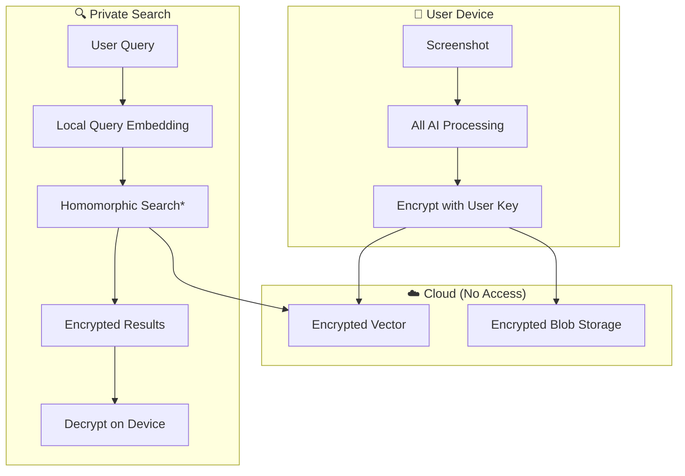

*Note: Full homomorphic encryption is computationally expensive; practical implementations use partial encryption or secure enclaves.*

---

## **🎓 ML Model Training & Personalization**

### **How Pool Learns Your Patterns**

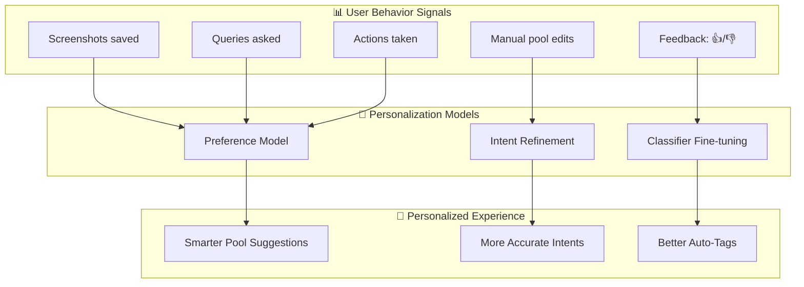

### **Intent Model Training**

```python
# User-specific intent model (lightweight, on-device possible)
class PersonalIntentModel:
    def __init__(self, user_id):
        self.user_id = user_id
        # Start with base model predictions
        self.intent_priors = defaultdict(lambda: 0.1)
        # Learn from user behavior
        self.intent_history = []

    def update(self, screenshot_id, actual_intent, predicted_intent):
        """Learn from user corrections"""
        self.intent_history.append({
            "predicted": predicted_intent,
            "actual": actual_intent,
            "features": self.get_features(screenshot_id)
        })

        # Update priors based on actual usage
        self.intent_priors[actual_intent] += 0.1
        self._normalize_priors()

    def predict(self, screenshot_features, base_predictions):
        """Adjust base model predictions with personal priors"""
        adjusted = {}
        for intent, score in base_predictions.items():
            # Bayesian update with personal prior
            prior = self.intent_priors[intent]
            adjusted[intent] = score * (1 + prior)
        return self._normalize(adjusted)

```

### **Feedback Loop**

| Signal | Weight | What It Means |
| --- | --- | --- |
| User moves screenshot to different pool | High | Wrong auto-classification |
| User creates manual pool | Medium | New intent category needed |
| User asks about specific screenshot | Low | Validates relevance |
| User deletes screenshot | Low | Not valuable content |
| User shares pool | High | High-value content |
| User takes action (calendar, etc.) | High | Correct action suggestion |

---

## **📡 API Examples**

### **Screenshot Upload**

```bash
# POST /api/v1/screenshots
curl -X POST https://api.pool.day/v1/screenshots \
  -H "Authorization: Bearer $TOKEN" \
  -F "image=@screenshot.png" \
  -F "source_app=Instagram" \
  -F "device=iPhone 15 Pro"

```

**Response:**

```json
{
  "id": "ss_abc123xyz",
  "status": "processing",
  "quick_actions": [
    {
      "type": "add_to_wishlist",
      "confidence": 0.92,
      "data": {
        "product": "Nike Air Max 90",
        "price": "$149.99",
        "store": "Nike.com"
      }
    },
    {
      "type": "track_price",
      "confidence": 0.87
    }
  ],
  "estimated_ready_at": "2025-12-15T10:30:05Z"
}

```

### **Query Screenshots**

```bash
# POST /api/v1/query
curl -X POST https://api.pool.day/v1/query \
  -H "Authorization: Bearer $TOKEN" \
  -H "Content-Type: application/json" \
  -d '{
    "query": "What restaurants did I save in Tokyo?",
    "include_images": true,
    "limit": 10
  }'

```

**Response:**

```json
{
  "answer": "You saved 5 restaurants in Tokyo during your November trip:\n\n1. **Sukiyabashi Jiro** - Famous sushi spot in Ginza\n2. **Ichiran Ramen** - Late night ramen in Shibuya\n3. **Gonpachi** - The 'Kill Bill' restaurant\n4. **Tsukiji Outer Market** - Fresh seafood stalls\n5. **Narisawa** - Fine dining (2 Michelin stars)",
  "sources": [
    {
      "id": "ss_tokyo_001",
      "thumbnail": "https://cdn.pool.day/thumb/ss_tokyo_001.webp",
      "relevance_score": 0.94,
      "saved_at": "2025-11-20T19:30:00Z"
    },
    // ... more sources
  ],
  "suggested_followups": [
    "Show me the addresses",
    "Which one was the most expensive?",
    "Add these to a Tokyo recommendations pool"
  ]
}

```

### **Execute Action**

```bash
# POST /api/v1/actions/execute
curl -X POST https://api.pool.day/v1/actions/execute \
  -H "Authorization: Bearer $TOKEN" \
  -H "Content-Type: application/json" \
  -d '{
    "screenshot_id": "ss_ticket_123",
    "action_type": "add_to_calendar",
    "params": {
      "title": "Taylor Swift Concert",
      "date": "2025-12-15",
      "time": "20:00",
      "location": "Madison Square Garden",
      "reminder": "2_hours_before"
    }
  }'

```

**Response:**

```json
{
  "success": true,
  "action_id": "act_cal_789",
  "result": {
    "calendar_event_id": "evt_abc123",
    "calendar": "Personal",
    "reminder_set": true
  },
  "message": "Added to your calendar with a reminder 2 hours before!"
}

```

---

## **💰 Cost Optimization**

### **AI API Cost Breakdown**

| Operation | Model | Cost per 1K | Screenshots/$ |
| --- | --- | --- | --- |
| **OCR** | Google Vision | $1.50 | 667 |
| **Vision Analysis** | GPT-4V | $10.00 | 100 |
| **Vision Analysis** | Claude 3 Haiku | $0.25 | 4,000 |
| **Embedding** | text-embedding-3-small | $0.02 | 50,000 |
| **Embedding** | text-embedding-3-large | $0.13 | 7,700 |
| **Query (LLM)** | GPT-4 Turbo | $10.00 | ~200 queries |
| **Query (LLM)** | Claude 3 Haiku | $0.25 | ~8,000 queries |

### **Cost-Optimized Pipeline**

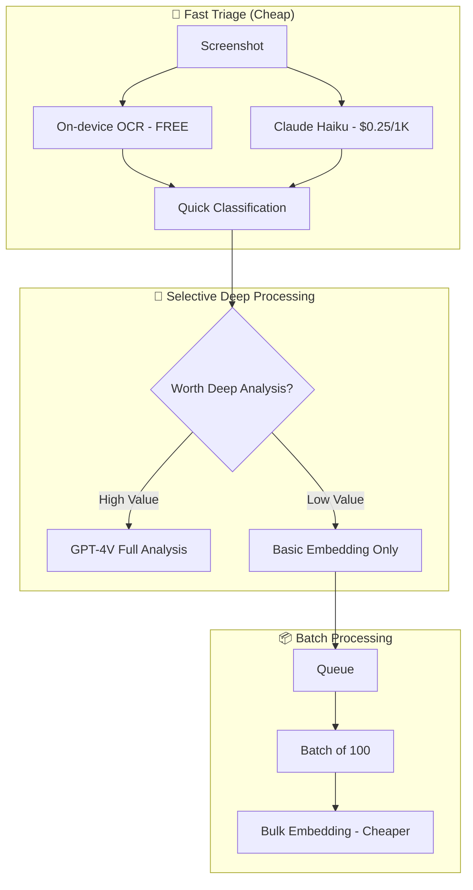

### **Monthly Cost Estimate (10K Active Users)**

| Item | Volume | Unit Cost | Monthly Cost |
| --- | --- | --- | --- |
| Screenshots processed | 500K | $0.003 (optimized) | $1,500 |
| Vector storage | 5M vectors | $0.025/1K | $125 |
| PostgreSQL (Supabase) | 50GB | $25/mo | $25 |
| S3 Storage | 500GB | $0.023/GB | $12 |
| LLM Queries | 200K | $0.002 avg | $400 |
| **Total** |  |  | **~$2,000/mo** |

**Cost per user:** ~$0.20/month

---

## **🔄 On-Device vs Cloud Trade-offs**

### **Processing Decision Matrix**

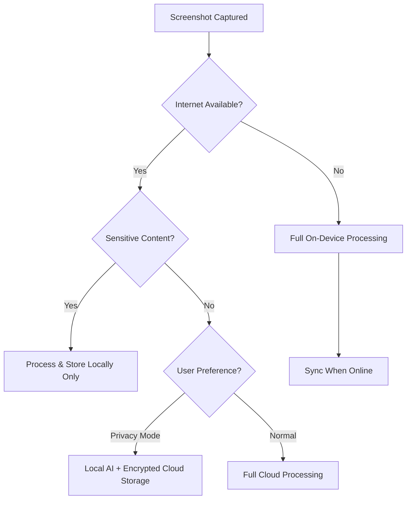

### **Comparison**

| Aspect | On-Device | Cloud | Hybrid |
| --- | --- | --- | --- |
| **Privacy** | ✅ Maximum | ⚠️ Depends on encryption | ✅ Good |
| **Speed** | ⚡ Instant | 🕐 1-3 seconds | ⚡ Actions fast |
| **Accuracy** | ⚠️ Limited models | ✅ Best models | ✅ Best models |
| **Battery** | ❌ High drain | ✅ Low drain | ⚠️ Medium |
| **Offline** | ✅ Works | ❌ No | ⚠️ Basic works |
| **Cost** | ✅ Free | 💰 API costs | 💰 Reduced |
| **Cross-device** | ❌ No sync | ✅ Full sync | ✅ Full sync |

### **On-Device Models (Core ML / TensorFlow Lite)**

| Task | Model | Size | Accuracy vs Cloud |
| --- | --- | --- | --- |
| **OCR** | Apple Vision | Built-in | 95% |
| **Quick Classification** | MobileNet V3 | 5MB | 80% |
| **Object Detection** | YOLO V8 Nano | 6MB | 75% |
| **Embedding** | MiniLM (quantized) | 20MB | 85% |
| **Intent (fine-tuned)** | DistilBERT | 60MB | 88% |

### **Recommended Architecture**

```
SCREENSHOT CAPTURED
        │
        ▼
┌──────────────────────────┐
│   ON-DEVICE (Instant)    │
│  ├── Apple Vision OCR    │
│  ├── Quick classifier    │
│  └── Local embedding     │
└────────────┬─────────────┘
             │
             ▼
     ┌───────────────┐
     │ Suggest Quick │ ◄── User sees in < 1 second
     │    Actions    │
     └───────┬───────┘
             │
             ▼ (Background)
┌──────────────────────────┐
│   CLOUD (Async, Deep)    │
│  ├── GPT-4V analysis     │
│  ├── High-quality embed  │
│  ├── Knowledge graph     │
│  └── Cross-device sync   │
└──────────────────────────┘

```

---

## **🏭 Production Infrastructure**

### **Deployment Architecture**

```
                                    ┌─────────────────┐
                                    │   Cloudflare    │
                                    │   CDN / WAF     │
                                    └────────┬────────┘
                                             │
                    ┌────────────────────────┼────────────────────────┐
                    │                        │                        │
                    ▼                        ▼                        ▼
           ┌──────────────┐         ┌──────────────┐         ┌──────────────┐
           │   API Pod    │         │   API Pod    │         │   API Pod    │
           │  (FastAPI)   │         │  (FastAPI)   │         │  (FastAPI)   │
           └──────┬───────┘         └──────┬───────┘         └──────┬───────┘
                  │                        │                        │
                  └────────────────────────┼────────────────────────┘
                                           │
          ┌────────────────────────────────┼────────────────────────────────┐
          │                                │                                │
          ▼                                ▼                                ▼
   ┌─────────────┐                 ┌─────────────┐                 ┌─────────────┐
   │  PostgreSQL │                 │   Pinecone  │                 │    Redis    │
   │  (Supabase) │                 │ (Vectors)   │                 │   (Cache)   │
   └─────────────┘                 └─────────────┘                 └─────────────┘
          │
          ▼
   ┌─────────────┐
   │    Neo4j    │
   │   (Graph)   │
   └─────────────┘

   Background Workers:
   ┌─────────────────────────────────────────────────────────────────────────┐
   │  [AI Processor] ──► [Embedding Worker] ──► [Graph Linker] ──► [Notifier]│
   │       │                    │                     │                      │
   │       ▼                    ▼                     ▼                      │
   │   OpenAI API          Pinecone              Neo4j                 Push  │
   └─────────────────────────────────────────────────────────────────────────┘

```

### **Monitoring & Observability**

| Tool | Purpose |
| --- | --- |
| **Datadog / Grafana** | Metrics, dashboards |
| **Sentry** | Error tracking |
| **Langfuse / LangSmith** | LLM observability |
| **PostHog** | Product analytics |
| **PagerDuty** | Alerting |

---

## **🎯 Summary: The Complete Technical Picture**

```
┌─────────────────────────────────────────────────────────────────────────────┐
│                           POOL.DAY TECHNICAL STACK                          │
├─────────────────────────────────────────────────────────────────────────────┤
│                                                                             │
│  📱 CAPTURE ──► 🧠 UNDERSTAND ──► 💾 STORE ──► 🔍 QUERY ──► ⚡ ACT          │
│                                                                             │
│  ┌─────────┐   ┌────────────┐   ┌─────────┐   ┌─────────┐   ┌─────────┐   │
│  │ iOS/    │   │ GPT-4V     │   │Pinecone │   │ RAG     │   │Calendar │   │
│  │ Android │──►│ OCR        │──►│Postgres │──►│ Pipeline│──►│Maps     │   │
│  │ Apps    │   │ CLIP       │   │Neo4j    │   │ LLM     │   │Grocery  │   │
│  └─────────┘   └────────────┘   └─────────┘   └─────────┘   └─────────┘   │
│                                                                             │
│  Key Technologies:                                                          │
│  • Vision: GPT-4V, Claude Vision, CLIP, Apple Vision                       │
│  • Embeddings: OpenAI, Cohere, SigLIP                                      │
│  • Vector DB: Pinecone, Qdrant, Weaviate                                   │
│  • Graph: Neo4j                                                            │
│  • LLM: GPT-4, Claude 3, Gemini                                            │
│  • Mobile: Swift, Kotlin, Core ML                                          │
│  • Backend: FastAPI, PostgreSQL, Redis                                     │
│  • Infra: AWS/GCP, Cloudflare, Vercel                                      │
│                                                                             │
│  Cost: ~$0.20/user/month at scale                                          │
│  Latency: <2s for actions, <5s for queries                                 │
│  Privacy: E2E encryption available, on-device processing option            │
│                                                                             │
└─────────────────────────────────────────────────────────────────────────────┘

```

---

*This is how Pool.day could transform a simple screenshot into an intelligent, actionable piece of your second brain.*